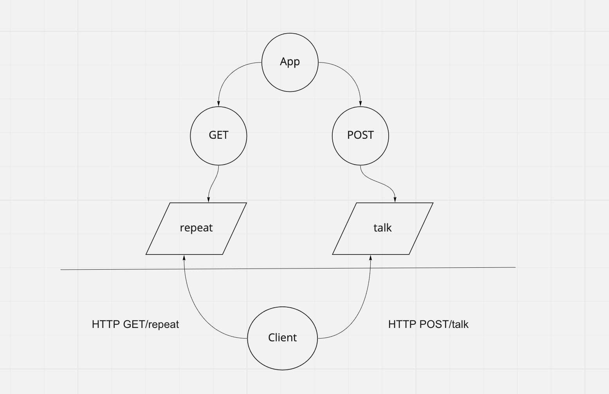

# server-deployment-practice

Created by Harvey Lucas

## Installation

```plaintext
> npm init -y
> npm install dotenv express jest supertest
```

## Summary of Problem Domain

### Lab: Class 01

Create and deploy a web server using CI and CD.

## Links to application deployment

## Visual



## Routes

- HTTP GET

  - Path: /repeat
    - responds with the last string used in post route `/talk`.

- HTTP POST
  - Path: /talk
    - Accepts a string.
    - responds with a string in all caps.
